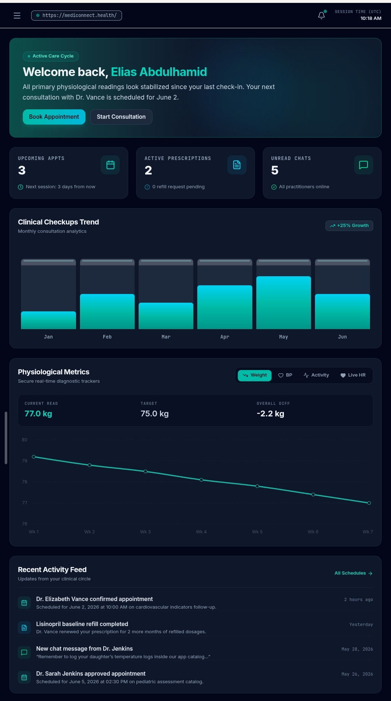

# MediCare TeleHealth

A full‑stack telehealth platform with patient, doctor, and admin dashboards. Built with Next.js 14, Tailwind CSS, and mock data to simulate a real‑world healthcare system.


## 🚀 Live Demo
https://mediconnect-845882354658.europe-west2.run.app/

## 📸 Screenshots



## 🏆 Lighthouse Targets
- **Performance:** 90+
- **Accessibility:** 100
- **Best Practices:** 100
- **SEO:** 100

## ✨ Features

### 👤 Patient Dashboard
- View upcoming appointments with status badges (Confirmed, Completed, Cancelled)
- Book new appointments via a multi‑step form (select doctor, date/time, reason)
- View prescription history (mock)
- Update profile information

### 🩺 Doctor Dashboard
- Today’s appointment list with patient names and time slots
- Start consultation (leads to simulated video call UI)
- Write and send prescriptions (saved to mock state)
- Set availability (toggle days/hours)

### 🔧 Admin Dashboard
- Overview stats: Total Patients, Doctors, Appointments Today, Revenue
- Charts: Appointments per month (line), Revenue by department (bar)
- Manage doctors and patients (CRUD on local state)
- All data is static mock data, but the interface mirrors a real admin panel

### 📹 Video Consultation Simulation
- Full‑page video call UI with large patient video and small doctor overlay
- Call controls: mute, camera off, end call (all simulated)
- Chat panel with mock messages
- “Prescribe” button (doctor only)

### 🔔 Notifications
- Bell icon with unread count
- Mock notifications: “Appointment confirmed”, “New prescription available”

## 🧱 Technical Architecture
- **Framework:** Next.js 14 (App Router)
- **Language:** TypeScript (strict mode)
- **Styling:** Tailwind CSS with dark/light mode
- **Charts:** Chart.js via react-chartjs-2 (dynamic import, `ssr: false`)
- **State Management:** React Context + local state
- **Mock Data:** All data lives in `/lib/mock-data.ts`
- **API Routes:** `/api/appointments`, `/api/users`, `/api/prescriptions` (all return mock data)
- **Accessibility:** Skip‑to‑content link, semantic HTML, `aria-label` on interactive elements, keyboard navigable, color contrast meets WCAG AA

## 📁 Project Structure


```
mediconnect/
├── public/                     # Static assets (favicon, images, etc.)
├── src/
│   ├── components/             # React components
│   │   ├── AppointmentsView.tsx  # Appointment scheduling & management
│   │   ├── ConsultationsView.tsx # Live chat with doctors
│   │   ├── DashboardView.tsx     # Main dashboard overview
│   │   ├── DoctorsView.tsx       # Doctor directory & selection
│   │   ├── PrescriptionsView.tsx # Prescription tracking & renewal
│   │   ├── SettingsView.tsx      # User settings & preferences
│   │   └── Sidebar.tsx           # Navigation sidebar
│   ├── lib/
│   │   └── data.tsx            # Mock data & type exports
│   ├── App.tsx                 # Root component with state management
│   ├── main.tsx                # React entry point
│   ├── types.tsx               # TypeScript type definitions
│   ├── index.css               # Global styles
│   └── assets/                 # Additional assets (images, icons)
├── .aistudio/                  # AI Studio configuration (for AI-assisted features)
├── package.json
├── vite.config.ts
├── tsconfig.json
├── index.html
├── .env.example
├── .gitignore
└── README.md
```


## 🛠️ Getting Started
```bash
git clone https://github.com/your-username/medicare-telehealth.git
cd medicare-telehealth
npm install
npm run dev

Open http://localhost:3000 and choose a role (Patient, Doctor, or Admin) to explore.

📄 License

MIT – feel free to use and adapt!

---
